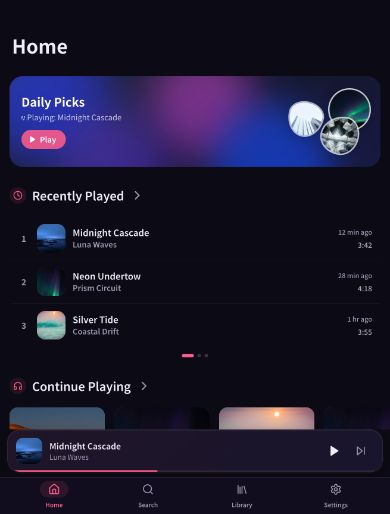
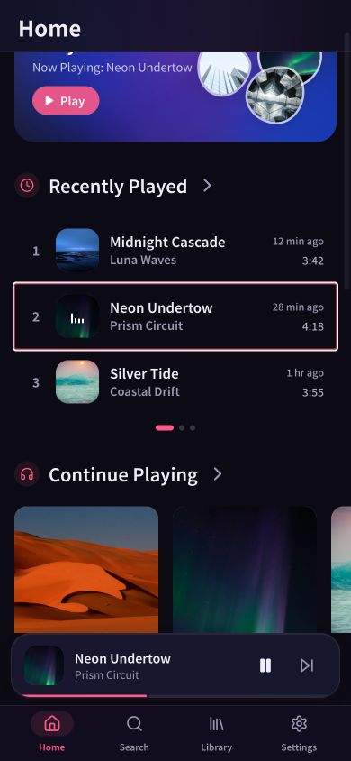
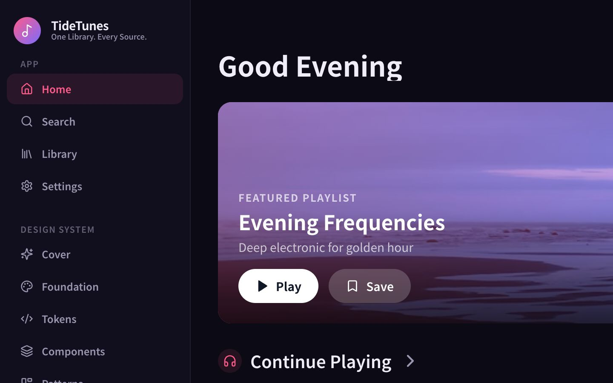

# TideTunes 点击效果一致性审查

日期：2026-07-19

## 审查范围

主页移动端与横屏端的分区标题、歌曲行、内容卡片、播放按钮、播放器控制、侧边栏和底部导航。

## 截图步骤

### 1. 移动端主页初始状态 — 基础视觉健康，但点击语言不统一

- Section Header、歌曲行、卡片和底部导航看起来都可点击，但它们使用了不同强度或没有按压反馈。
- 分区标题已统一使用同一组件，这是目前最稳定的一组交互。

### 2. 点击歌曲后的状态 — 需要优先修正焦点反馈

- 点击歌曲后出现持续的亮色外框，视觉上像“选中高亮”，与已移除的播放高亮冲突。
- 动态音柱能表达正在播放，不需要再叠加持久边框。
- 指针点击与键盘焦点应分开：指针点击不保留边框，键盘使用 `focus-visible` 焦点环。

### 3. 横屏主页 — 不同组件家族的反馈差异明显

- Hero Play 使用 `0.95` 按压缩放，而 Save 没有按压状态。
- 内容卡片使用 `0.97`，分区标题使用 `0.985`，侧边栏只改变背景色。
- 不同家族可以有不同反馈，但同一家族需要共享同一规则。

## 主要发现

1. 代码中存在 12 种 `whileTap` 缩放值（`0.84` 到 `0.99`），另有 `active:scale-90` 和 `active:scale-95` 两套 CSS 规则。
2. 播放器控制最混乱：同一组按钮同时使用 `0.84`、`0.85`、`0.88` 和 `0.90`。
3. `HomeSectionHeader` 是按钮并有按压效果，但没有点击行为；用户得到反馈后页面没有变化。
4. Album、Artist、Playlist 卡片使用可点击 `div`，键盘和辅助技术无法稳定识别为按钮。
5. Save、底部导航、侧边栏导航和部分 Mini Player 控件缺少统一的按压状态。
6. 部分控件有 `focus-visible`，部分使用浏览器默认焦点，导致点击后出现不一致的持久外框。

## 建议统一规则

| 组件家族 | 推荐反馈 | 统一值 |
| --- | --- | --- |
| 歌曲行、分区标题 | 轻微按压 + 背景变化 | `scale: 0.985` |
| Album、Artist、Playlist 卡片 | 卡片整体按压 | `scale: 0.97`，统一 spring `400/30` |
| Primary、Secondary 按钮 | 明确但不过度的按压 | `scale: 0.95` |
| Icon-only 播放器控件 | 快速轻按 | `scale: 0.92` |
| Sidebar、Bottom Nav | 不缩放，只改变背景、颜色或透明度 | `180ms` |

所有控件统一使用：

- 视觉过渡时长 `180ms`。
- 指针点击不保留焦点边框。
- 键盘焦点统一 `focus-visible:ring-2 focus-visible:ring-primary/40`。
- 没有实际行为的元素不显示按压反馈，也不使用 `button` 语义。
- 卡片需要改为 `button`，或补充 `role="button"`、`tabIndex=0` 和键盘事件；优先使用原生 `button`。

## 建议修改顺序

1. 修正歌曲行的默认焦点外框。
2. 决定分区标题点击后的真实行为；没有目标页面时移除点击反馈。
3. 把播放器的 6 种缩放强度合并为 Icon-only 的 `0.92`。
4. 统一 Card、Button、Row、Navigation 四类交互 token。
5. 补齐卡片的键盘语义与焦点样式。

## 实施状态

已按上述顺序完成：歌曲行的鼠标点击不再残留焦点框；主页分区标题会打开 Library 对应分类；播放器图标按钮统一为 `0.92`；歌曲行、卡片、主要按钮和导航分别使用统一的交互强度；Album、Artist、Playlist 与歌曲卡片已使用原生按钮语义并保留 `focus-visible` 键盘焦点。Hero 的 Save 也补齐了真实的保存/取消保存状态。

## 证据限制

- 截图可确认静态、播放后和响应式状态；瞬时按压幅度主要依据代码值审查。
- 未进行屏幕阅读器测试，因此不能据此声明完整的无障碍合规。
- 浏览器控制台在本次审查中无错误或警告。
