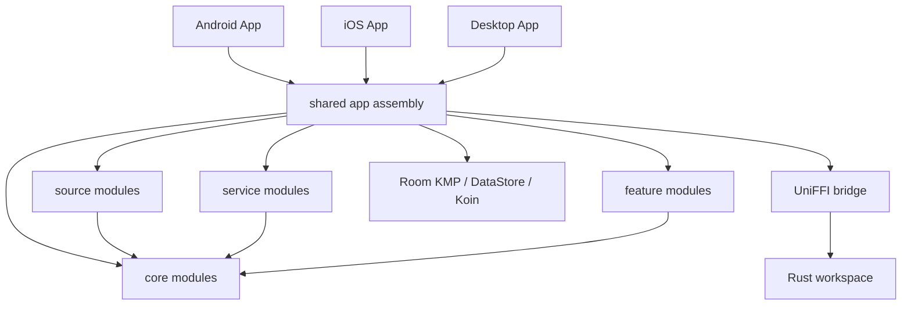

# MelodyTrove

[English](./README.md) · [简体中文](./README.zh-CN.md)

MelodyTrove（旋律珍藏）is a self-hosted and local-first music player built with Kotlin Multiplatform, Compose Multiplatform, Rust, and UniFFI. It provides one shared music library across Android, iOS, and Desktop while keeping playback resources, credentials, and provider-specific details behind explicit source boundaries.

> This project was formerly published as TideTunes. Existing installs and integrations are covered by the documented compatibility migration.

> [!IMPORTANT]
> MelodyTrove is under active development. The current app version is `0.3.0`; user-facing behavior, database migrations, and extension APIs may continue to evolve before a stable release.

## Highlights

- **Android, iOS, and Desktop** from a shared Kotlin and Compose codebase.
- **Local, WebDAV, and SMB2/3 music sources** with browsing, indexed search, streaming, and downloads.
- **Source-agnostic Room KMP library** for tracks, albums, artists, genres, artwork, lyrics, playlists, downloads, and sync state.
- **Adaptive UI** with compact bottom navigation, medium navigation rail, and large-screen desktop sidebar layouts.
- **Cross-platform playback abstraction** backed by Android Media3, iOS AVPlayer, and a Rust/rodio Desktop engine.
- **Offline downloads** through Android WorkManager, iOS background URLSession, and a Desktop coroutine scheduler.
- **Selective remote metadata scanning** for WebDAV and SMB with Fast, Standard, and Full modes.
- **JavaScript metadata plugins** compatible with Lyrico Plugin API v1-v3, executed in isolated QuickJS runtimes.
- **Rust backend** for remote storage, metadata parsing, plugin execution, playback support, and UniFFI bindings.

## Current Features

### Music library and browsing

- Home, Search, Library, and Settings top-level destinations.
- Track, album, artist, genre, playlist, recently added, recently played, radio, queue, lyrics, and now-playing screens.
- Room-backed full-text library search and source-scoped provider search.
- Canonical tracks that may reference multiple playable source items.
- Playlist persistence with stable ordering.
- Embedded and sidecar lyrics, artwork metadata, and raw audio tags.
- Responsive navigation and desktop-specific toolbar/right-panel layouts.

### Music sources

| Source | Browse | Search | Stream | Download | Incremental sync |
| --- | :---: | :---: | :---: | :---: | :---: |
| Local | Yes | Yes | Yes | Yes | No |
| WebDAV | Yes | Yes | Yes | Yes | No |
| SMB2/3 | Yes | Yes | Yes | Yes | No |

Source adapters authenticate, browse, search, and resolve playback resources. They do not write directly to the canonical music tables.

### Remote metadata scan modes

| Mode | Behavior |
| --- | --- |
| **Fast** | Reads core tags and audio properties, detects embedded-artwork presence without extracting or caching the image, and skips lyrics and raw tags. |
| **Standard** | Reads core tags, audio properties, and embedded lyrics, detects embedded-artwork presence without extracting or caching the image, and skips raw tags. This is the default for new installations. |
| **Full** | Reads core tags, audio properties, artwork, lyrics, and raw metadata. |

Skipped optional metadata is preserved rather than deleted. Missing artwork or lyrics can be backfilled later from Settings without forcing the remote file fingerprint to change.

Fast and Standard persist per-source artwork presence in `track_source_ref` without storing image bytes in Room. Seekable formats such as MP3, M4A/MP4, FLAC, APE/WavPack, and ID3 inside WAV/AIFF skip the image payload. Ogg/Opus artwork is commonly embedded in a Vorbis Comment packet, so the containing comment packet may still need to be read.

### Playback and downloads

- Shared playback state, position, queue, play mode, and now-playing presentation contracts.
- Playback URLs, headers, cookies, and expiring tokens are resolved just before playback and are not stored in Room.
- Android playback through Media3 and MediaSession.
- iOS playback through an AVPlayer-backed engine adapter.
- Desktop playback through the Rust/rodio backend.
- Persistent download tasks with pause, resume, retry, cancel, and progress state.
- Platform schedulers:
  - Android: WorkManager
  - iOS: background URLSession
  - Desktop: coroutine-based scheduler

### Lyrico-compatible metadata plugins

MelodyTrove supports user-supplied ZIP plugins that implement Lyrico Plugin API v1-v3 `MetaSource` behavior. Plugins extend metadata, cover, and lyric lookup; they are intentionally separate from general playback `MusicSource` providers.

Accepted manual matches update the library's canonical metadata without modifying the audio
file. Those descriptive fields remain protected during background scans until **Reset from
file** explicitly reloads the current tags from the preferred available source.

The current plugin pipeline is:

```text
Plugin ZIP
  -> validation and bounded extraction
  -> Room-backed installation and configuration
  -> observable MetaSource registry
  -> lazy isolated QuickJS worker
  -> searchSongs / getLyrics / searchCovers
  -> normalized MelodyTrove metadata results
```

Implemented plugin capabilities include:

- ZIP import, manifest validation, update, enable/disable, configuration, cache clearing, and uninstall.
- Official v3 configuration field types and conditional field visibility.
- Manual, automatic, and batch lookup permissions.
- Structured, translated, romanized, and raw lyric formats.
- Song and cover result aliases used by real-world Lyrico plugins.
- Per-plugin runtime isolation, memory/stack limits, timeouts, cancellation, and poisoned-runtime recovery.
- Host APIs for HTTP, cache, crypto, base64, bytes, compression, XML, logging, app, and runtime information.
- Redirect and private-network validation, response-size limits, and sensitive-log filtering.

Third-party plugin ZIPs are not bundled or downloaded by MelodyTrove; users provide them locally. See [Plugin Runtime](./docs/plugin-runtime.md) for the compatibility and security model.

## Architecture



### Design principles

1. **One UI-facing database**  
   Android, iOS, and Desktop use the same Room KMP schema with bundled SQLite.

2. **Canonical library data is provider-independent**  
   Tracks, albums, artists, genres, lyrics, artwork, playlists, and downloads do not belong to WebDAV or any other provider.

3. **Source identity is stored separately**  
   Source accounts, library roots, source items, sync cursors, provider properties, and track-to-source references preserve remote identity without polluting canonical music entities.

4. **Transient playback resources are never canonical data**  
   Signed URLs, HTTP headers, tokens, cookies, and temporary loopback URLs are resolved at playback time and are not persisted as track fields.

5. **Features depend on contracts, not platform engines**  
   Common code consumes playback, download, sync, source, and repository interfaces. Media3, AVPlayer, rodio, Room, and UniFFI stay at platform or data boundaries.

6. **Metadata plugins are not playback providers**  
   JavaScript plugins implement metadata lookup through `MetaSource`; Local, WebDAV, and SMB implement playback and browsing through `MusicSource`.

More detailed documents:

- [Architecture report](./docs/architecture/final-architecture.md)
- [Room KMP schema](./docs/database/schema.md)
- [SMB music source](./docs/music-sources/smb.md)
- [Plugin runtime](./docs/plugin-runtime.md)
- [Test report](./docs/testing/test-report.md)

## Repository Structure

```text
MelodyTrove/
├── androidApp/                  Android application entry point
├── desktopApp/                  Desktop JVM application entry point
├── iosApp/                      SwiftUI container and Xcode project
├── shared/                      App assembly, navigation, DI, Room, data layer, platform actuals
├── core/
│   ├── domain/                  Pure domain models and repository contracts
│   ├── presentation/            Shared design system and presentation utilities
│   ├── lyrics-core/             Shared lyric models and processing
│   └── lyrics-ui/               Shared lyric UI
├── source/
│   ├── api/                     MusicSource contracts and registry
│   ├── local/                   Local source adapter
│   ├── smb/                     SMB2/3 source adapter
│   └── webdav/                  WebDAV source adapter
├── service/
│   ├── playback/domain/         Playback engine/controller/queue contracts
│   ├── playback/presentation/   Now Playing and playback UI state
│   ├── download/domain/         Download contracts and use cases
│   ├── download/data/           Persistent download implementation
│   ├── librarysync/domain/      Library sync contracts
│   └── librarysync/data/        Sync persistence and coordination
├── feature/                     Home, library, search, settings, sources, playlists, etc.
├── rust-libs/
│   ├── backend/                 UniFFI-facing backend facade
│   ├── async-runtime/           Shared Rust async runtime support
│   ├── storage-backend/         Remote storage and scanning
│   ├── audio-metadata/          Audio metadata extraction
│   ├── plugin-runtime/          QuickJS plugin host
│   ├── order-key/               Stable ordering keys
│   └── uniffi-bindgen/          UniFFI binding generator helper
├── build-logic/convention/      Gradle convention plugins
├── docs/                        Architecture, schema, runtime, and test documentation
├── Design/                      UI design references and generated design assets
└── gradle/libs.versions.toml    Central dependency and plugin version catalog
```

The Gradle project currently includes dedicated feature modules for Home, Search, Downloads, Settings, Playlist, Sources, Importing, Onboarding, Queue, Radio, Lyrics, Album, Artist, Browse, Library, Recently Added, and Recently Played.

## Technology Stack

| Area | Technologies |
| --- | --- |
| Shared language | Kotlin 2.4, Kotlin Multiplatform |
| UI | Compose Multiplatform, JetBrains Navigation Compose, Miuix |
| Dependency injection | Koin |
| Persistence | Room KMP, bundled SQLite, DataStore |
| Concurrency and serialization | Coroutines, kotlinx.serialization, kotlinx.datetime |
| Android playback | AndroidX Media3 / MediaSession |
| iOS host | SwiftUI, UIKit bridge, AVPlayer engine adapter |
| Desktop | Compose Desktop, JVM 21, Rust/rodio playback |
| Native backend | Rust, UniFFI, Gobley Gradle integration |
| Plugins | QuickJS-based JavaScript runtime, Lyrico Plugin API v1-v3 |
| CI | GitHub Actions, Gradle, Cargo |

## Requirements

### Common

- Git
- JDK 21
- Rust stable toolchain with Cargo
- A recent Android Studio or IntelliJ IDEA with Kotlin Multiplatform support

### Android

- Android SDK platform 37 and compatible build tools
- Android NDK with Rust Android target support; CI currently uses NDK `r28-beta2`
- Rust targets:

```bash
rustup target add aarch64-linux-android x86_64-linux-android
cargo install --locked cargo-ndk@3.5.4
```

The Android app uses `minSdk 29`, `targetSdk 34`, and `compileSdk 37`. The packaged application currently targets `arm64-v8a`; shared native builds also cover `x86_64` for development and tests.

### iOS

- macOS with Xcode
- iOS 16.0 or later
- Apple Silicon, or an arm64 iOS Simulator destination

The Gradle project defines `iosArm64` and `iosSimulatorArm64`. An x86_64 simulator target is not configured.

### Linux Desktop

Install ALSA development headers and `pkg-config` before building the Desktop target:

```bash
sudo apt-get update
sudo apt-get install --yes libasound2-dev pkg-config
```

## Build from Source

Clone the repository:

```bash
git clone https://github.com/JulyStar-Lv/MelodyTrove.git
cd MelodyTrove
```

### Android

Build a debug APK:

```bash
./gradlew :androidApp:assembleDebug
```

The APK is generated under `androidApp/build/outputs/apk/`.

Release builds require `androidApp/key.properties` and a valid signing keystore. Do not commit signing credentials.

### Desktop

Run the Desktop application:

```bash
./gradlew :desktopApp:run
```

Compile the Desktop target and run shared Desktop tests:

```bash
./gradlew :desktopApp:compileKotlinDesktop :shared:desktopTest
```

Package a distribution for the current operating system:

```bash
./gradlew :desktopApp:packageDistributionForCurrentOS
```

Compose Desktop is configured for DMG, MSI, and DEB distributions.

### iOS

Open the Xcode project:

```bash
open iosApp/App.xcodeproj
```

Select the `App` scheme and an arm64 simulator or physical device. The Xcode build phase invokes:

```bash
./gradlew :shared:embedAndSignAppleFrameworkForXcode
```

A command-line simulator build can be run with:

```bash
xcodebuild \
  -project iosApp/App.xcodeproj \
  -scheme App \
  -configuration Debug \
  -sdk iphonesimulator \
  -destination 'generic/platform=iOS Simulator' \
  ARCHS=arm64 \
  ONLY_ACTIVE_ARCH=YES \
  CODE_SIGNING_ALLOWED=NO \
  build
```

### Rust workspace

Format, lint, and test the Rust workspace:

```bash
cargo fmt --manifest-path rust-libs/Cargo.toml --all -- --check
cargo clippy --manifest-path rust-libs/Cargo.toml --workspace --all-targets -- -D warnings
cargo test --manifest-path rust-libs/Cargo.toml --workspace
```

## Testing and CI

The `Build validation` GitHub Actions workflow runs on pushes and pull requests to `main`.

Current CI gates include:

- Android debug APK compilation with JDK 21, Android SDK 37, NDK, and Rust Android targets.
- Desktop Kotlin compilation and shared Desktop tests.
- Rust formatting, Clippy, workspace unit tests, and focused plugin-runtime validation are documented in the repository test report.
- Cross-platform checks cover Android, Desktop, and iOS Simulator shared compilation.

Useful local commands:

```bash
# Repository-wide Gradle tests
./gradlew test

# Shared Desktop tests
./gradlew :shared:desktopTest

# Android shared unit tests
./gradlew :shared:testDebugUnitTest

# iOS Simulator shared tests
./gradlew :shared:iosSimulatorArm64Test

# Cross-platform compile gate
./gradlew \
  :shared:compileDebugKotlinAndroid \
  :desktopApp:compileKotlinDesktop \
  :shared:compileKotlinIosSimulatorArm64
```

Some live WebDAV tests require runtime-provided credentials. Secrets must never be committed to the repository.

## Development Notes

- Keep pure domain models free of Compose, Room, Media3, AVFoundation, rodio, and UniFFI types.
- Keep provider-specific fields in source entities or source item properties instead of adding them to canonical track entities.
- Resolve expiring playback resources at the playback boundary.
- Prefer immutable screen state with explicit Action/Event contracts for feature UI.
- Add Room migrations for every schema change and keep exported schemas updated.
- Do not commit WebDAV credentials, OAuth tokens, plugin secrets, signing files, or third-party plugin ZIPs.
- Run the relevant Gradle and Cargo checks before opening a pull request.

## Known Limitations

- The project is still pre-stable and does not guarantee backward compatibility for every development build.
- The iOS Simulator target is arm64 only.
- Third-party Lyrico plugin ZIPs are user supplied and are not distributed by MelodyTrove.
- Runtime `include(path)` is intentionally unavailable after deterministic include-directory bundling; plugins cannot read arbitrary local files.
- Android production process termination relies on normal operating-system resource reclamation.
- Android lint currently has repository/tooling compatibility issues documented in the test report; build and unit-test gates remain the primary validation path.

## Roadmap

Near-term work is focused on:

- Hardening real-world Lyrico plugin compatibility and plugin diagnostics.
- Improving large-library import, incremental sync, background scanning, and metadata backfill performance.
- Continuing the adaptive UI/UX, accessibility, and desktop interaction work.
- Expanding source providers and improving provider-specific sync behavior.
- Strengthening release packaging, automated distribution, and end-user documentation.

The roadmap is directional and may change as the architecture and platform support mature.

## Contributing

Issues and pull requests are welcome. Before submitting a change:

1. Keep changes within the existing module and dependency boundaries.
2. Add or update tests for behavior changes.
3. Run the relevant Gradle and Cargo checks.
4. Document schema, plugin API, source contract, or platform requirement changes.
5. Never include private credentials, copyrighted plugin packages, or personal library data.

## License

Most of MelodyTrove is licensed under the [GNU General Public License v3.0](./LICENSE.md).

The [`order-key`](./rust-libs/order-key) crate is available under either the Apache License 2.0 or the MIT License.
