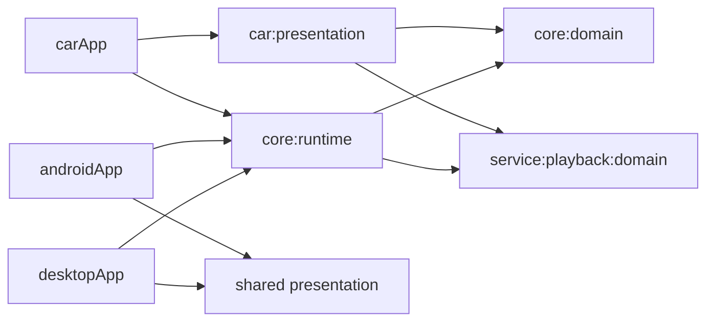
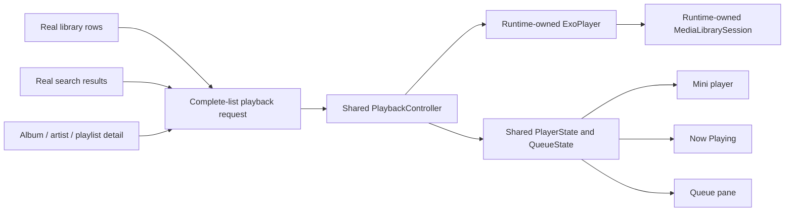

# TidePlayer Android Automotive Expanded delivery report

## Delivery decision

The Automotive app is developed on the dedicated branch
`codex/automotive-expanded` and ships as an independent Android application
module, `:carApp`. It lives in the same repository so it can reuse the domain and
runtime implementation without copying it. Its Compose UI is isolated in
`:car:presentation`, so Mobile UI changes do not leak into the car experience.

This is the recommended long-term structure: one repository and one shared runtime,
with separate application and presentation modules for Mobile and Automotive. A
permanent second repository would duplicate database, source, migration, playback,
queue, and release work. Merging the car screens into `:androidApp` would couple two
different manifests, navigation systems, focus models, and window contracts.

## Architecture delivered

The runtime-neutral functionality that both applications need was extracted into
`:core:runtime`. That module owns the Room database and schemas, DataStore and
credentials, source/storage adapters, library synchronization, search data,
settings, downloads, playback, queue persistence, ExoPlayer, and Media3
`MediaLibrarySession`. It also owns the single runtime Koin composition list.

`:carApp` owns the Automotive package, manifest, Activity, process bootstrap, and
Media3 controller attachment. `:car:presentation` owns the Expanded shell, semantic
theme, screens, layout profiles, focus graph, and input routing. Neither Car module
depends on `:shared`, `:androidApp`, Mobile feature presentation, core presentation,
or playback presentation.

Static ownership scans find exactly one `ExoPlayer.Builder` and one
`MediaLibrarySession.Builder`, both in
`core/runtime/src/androidMain/.../PlaybackService.kt`. Car playback therefore uses
the same real player, MediaSession, persisted queue, source resolution, and
repository graph as the existing applications.

## Phase 0 window audit

The Phase 0 contract was inferred from the local FileManager source at
`C:/WorkSpace/CodeSpace/FileManager`, as authorized by the user. The source defines
the OEM state switch as follows:

- `key_screen_show == 0 && key_vpa_cui_show_left != 1` selects Expanded.
- Any other observed state selects VehiclePanel.
- If the OEM signal is unavailable, TidePlayer selects Expanded.

The source and layout assets also support these coordinate relationships: a 2496
wide full background inside an assumed 2560 canvas, and a left content origin of
`760 + 72 = 832`, leaving `2560 - 832 = 1728` for VehiclePanel. These are source
inferences. They are not measurements of physical display bounds, Android window
bounds, Compose content bounds, density, or system insets.

At runtime, the Activity passes live Compose constraints and insets to
`CarLayoutProfileResolver`. The resolver uses unitless design ratios and an OEM
profile hint. It contains no exact pixel-width trigger and never treats 2496 design
pixels as 2496 dp. The complete evidence table and replacement boundary are in
[`CAR_WINDOW_PROFILES.md`](CAR_WINDOW_PROFILES.md).

## Expanded Figma implementation

The source Figma file is
`5NO5nvLFdd2jPTwHmnJE8A`, page `0:1`. Ten Expanded screen families were read in
both Dark and Light modes. The implementation includes:

- the 352-wide navigation shell, app header, Exit action, library navigation, and
  mini player;
- Home, Songs, Albums, Artists, Playlists, album/artist/playlist details, Search,
  Settings, Now Playing, and Queue;
- real recently-added, recently-played and favorite Home sections, plus direct real
  Album/Artist/Playlist detail links; recommendation cards remain visibly disabled
  because the shared runtime has no recommendation contract;
- four-column Album and Artist grids and the 560/1424 Settings composition;
- the 1000/1328 Now Playing and Queue composition;
- semantic light/dark colors, typography, shapes, spacing, state visuals, and exact
  exported Figma vector paths for implemented controls;
- lazy lists and grids, stable domain keys, focus restoration, `bringIntoView`, and
  current-queue scrolling.

Representative traceability:

| Figma node | Compose implementation | Runtime metric |
|---|---|---|
| Home Dark `1:2`, Light `89:480` | `CarHomeScreen` | Expanded shell/content ratios |
| Albums `970:1176` / `970:2177` | `CarAlbumsScreen` | four columns, card/gutter ratios |
| Artists `970:1376` / `970:2377` | `CarArtistsScreen` | four columns, circular art |
| Settings `3:463` / `89:965` | `CarSettingsScreen` | 560/1424 two-pane structure |
| Now Playing `1:65` / `89:566` | `CarNowPlayingScreen` | 1000/1328 pane structure |
| Queue `1:122` / `89:642` | `CarQueuePane` | right-pane replacement state |

The full node-to-component mapping and design gaps are recorded in
[`FIGMA_EXPANDED_MAPPING.md`](FIGMA_EXPANDED_MAPPING.md). Search, dialogs, and
page-level loading/empty/error frames did not exist in the Figma file; their visual
contract is recorded separately in
[`SEARCH_AND_PAGE_STATE_CONTRACT.md`](SEARCH_AND_PAGE_STATE_CONTRACT.md).

Phase 14 visual acceptance was completed on the dedicated AAOS AVD
`TidePlayer_AAOS_Expanded`. Its physical display and fullscreen task are
2496 × 1080 at 160 dpi. AAOS reserves 76 px for the top status bar and 96 px for
the bottom car system bar; the measured Compose root is 2496 × 908 at
`[0,76][2496,984]`. The app receives those real constraints, so the Figma design
relationships are recalculated inside the safe content rectangle instead of scaling
or clipping a fixed 2496 × 1080 canvas.

Home Dark `1:2`, Settings Dark `3:463`, Now Playing Dark `1:65`, and Queue Dark
`1:122` were re-exported from Figma at their native size and compared with runtime
captures. Navigation and content proportions, information density, four-column
library grids, Settings columns, Mini Player, Now Playing panes, lyrics/empty state,
Queue readability, focus border and touch targets remain legible and unobscured.
Runtime data intentionally differs from the design fixture: unsupported
recommendations stay disabled, and the acceptance WAV files show the no-artwork and
no-lyrics states rather than fabricated album art or lyrics.

## Playback and queue graph

Selecting item N sends the complete visible collection and start index N to the
shared controller. Queue selection, ordering, current highlight, progress, buffered
position, artwork, lyrics, seek, shuffle, repeat, previous/next, pause, and media-key
actions all observe or call the shared runtime contracts. Media Stop maps to the
runtime's documented resumable pause behavior. The Car UI owns no player or queue.

## Focus and input

`CarFocusCoordinator` assigns stable semantic IDs and remembers focus by route. The
Expanded graph connects Navigation, Content, Mini Player, Now Playing controls, and
Queue. It handles touch/click and Enter through Compose interaction, central D-pad
routing, native rotary scroll events, and foreground media keys. Opening Queue
focuses the current row; closing Queue restores the Queue button. When a remembered
target no longer exists, the route falls back to its defined initial target.

The graph and input families are documented in
[`FOCUS_INPUT_CONTRACT.md`](FOCUS_INPUT_CONTRACT.md). Runtime acceptance exercised
touch, D-pad and Media Play/Pause/Next/Previous/Stop through AAOS Car Service.
AAOS accepted injected rotary hardware events; a Compose test additionally dispatches
a native rotary scroll event to the focused child and proves that the ancestor input
router moves focus through the declared graph. Steering-wheel media behavior uses the
same verified key path and MediaSession.

## Files changed by area

- `carApp/`: independent AAOS application, manifest, Activity, process bootstrap,
  resources, and ABI APK packaging.
- `car/presentation/`: Automotive theme, layout resolver, focus/input graph,
  navigation, components, screens, vector assets, and unit tests.
- `core/runtime/`: shared runtime ownership for persistence, sources, settings,
  search data, downloads, library sync, playback, queue, Media3 service/session, and
  platform implementations.
- `core/domain/`, `service/playback/domain/`: presentation-neutral contracts used by
  both application surfaces.
- `shared/`, `androidApp/`, `desktopApp/`, `feature/home/`, `feature/search/`: wiring
  changes needed to consume the extracted runtime while preserving existing apps.
- `docs/automotive/`: architecture, window, Figma, focus, playback, build, status,
  and future VehiclePanel contracts.

The branch history keeps runtime extraction, app scaffolding, feature delivery,
focus/input, and review fixes in separate commits so reviewers can inspect each
boundary independently.

## Verification evidence

All commands used `JAVA_HOME=C:/Software/Android Studio/jbr` on Windows.

| Command | Result |
|---|---|
| `:core:runtime:testDebugUnitTest :car:presentation:testDebugUnitTest :carApp:assembleDebug :androidApp:assembleDebug :desktopApp:compileKotlinDesktop` | BUILD SUCCESSFUL in 9m 49s; runtime 343 tests and Car 31 tests, zero failures/errors; both APK families rebuilt; Desktop compiled |
| `:car:presentation:testDebugUnitTest` after final Robolectric Queue coverage | BUILD SUCCESSFUL in 57s; 34 tests, zero failures/errors |
| `:car:presentation:testDebugUnitTest :carApp:assembleDebug` after final grid/settings correction | BUILD SUCCESSFUL in 1m 46s; 430 tasks |
| `:carApp:lintDebug` before final grid/settings correction | BUILD SUCCESSFUL in 6m 34s; 0 errors, 2 warnings |
| `:carApp:lintDebug` after final grid/settings correction | BUILD SUCCESSFUL in 2m 3s; 728 tasks; 0 errors, 2 warnings |
| `:carApp:lintDebug` after Home/Search/Now Playing and Compose-test review | BUILD SUCCESSFUL in 5m 23s; 728 tasks; 0 errors, 2 warnings |
| `:car:presentation:lintDebug` after final Compose Queue tests | BUILD SUCCESSFUL in 46s; 0 errors, 4 existing Compose parameter-order warnings |
| `:androidApp:assembleDebug :desktopApp:compileKotlinDesktop` after runtime extraction | BUILD SUCCESSFUL in 3m 56s |
| `:car:presentation:testDebugUnitTest --tests '*CarNavigationFocusComposeTest*'` after rotary acceptance test | BUILD SUCCESSFUL in 47s |
| `:core:runtime:testDebugUnitTest :car:presentation:testDebugUnitTest :carApp:assembleDebug :carApp:lintDebug :car:presentation:lintDebug :androidApp:assembleDebug :desktopApp:compileKotlinDesktop` final acceptance gate | BUILD SUCCESSFUL in 7m 55s; 1509 tasks; runtime 343 tests and Car 37 tests, zero failures/errors; both lint tasks, APKs and Desktop compile passed |
| `:car:presentation:testDebugUnitTest :carApp:assembleDebug` after final cancellation propagation review | BUILD SUCCESSFUL in 1m 36s; 435 tasks; 37 Car tests |

The two lint warnings are the repository target SDK being below the newest installed
SDK and the intentionally discoverable exported Media3 browser service lacking a
restrictive permission. Lint's analyzer also prints Kotlin metadata 2.4/2.2
diagnostics for dependency models, but the lint task completes and the text report
contains zero errors.

Final static checks report:

- no fixed `2496.dp`, `1080.dp`, `1728.dp`, or exact-width profile comparison;
- no Car dependency/import edge to Mobile presentation or `:shared`;
- one ExoPlayer builder and one MediaLibrarySession builder, both runtime-owned;
- no TODO, FIXME, placeholder exception, demo data, or unfinished Car code marker;
- cancellation is rethrown in asynchronous artwork/detail/search work, and real
  library load errors are exposed to Home and Library pages.

The 37 Automotive tests include architecture dependency/ownership scans, Expanded
profile selection, complete-list playback requests, Search filtering and duplicate
selection, Home loading/empty/error/content refresh behavior, playback progress,
repeat and queue identity, focus restore/fallback, and Robolectric Compose interaction
for navigation focus, D-pad traversal, song-row clicks/playing/disabled states, and
Mini Player open/Previous/Play/Pause/Next/disabled behavior, plus Now Playing Queue
open/close/system-Back behavior. The acceptance slice adds permission-resume/import
failure coverage and native rotary focus traversal.

Generated APKs:

- `carApp/build/outputs/apk/debug/carApp-arm64-v8a-debug.apk`
- `carApp/build/outputs/apk/debug/carApp-x86_64-debug.apk`

The merged debug manifest uses package
`io.github.julystar.musicapp.car.debug`, declares `com.android.automotive`, exposes
one launcher Activity, and exposes one runtime `PlaybackService` with media browse
and `MEDIA_PLAY_FROM_SEARCH` actions.

## Expanded runtime acceptance

The AVD ran the complete Phase 18 path with a real three-track MediaStore library:
launch, Expanded Home, local-library import, Songs, selecting item 2, complete
three-item queue, synchronized Mini Player, Now Playing metadata and progress,
Pause/Play/Next/Previous/Stop, Queue, selecting item 3, returning Home, Search, theme,
focus and touch. `dumpsys media_session` confirmed queue ordering, active item,
metadata and advancing playback state; the AAOS launcher media card independently
displayed Tide Player and the current track.

The initial cold debug launch revealed a startup ANR caused by UniFFI diagnostics,
Koin, Room and repository reload on the main thread. Startup now runs on a supervised
background scope with explicit Initializing/Ready/Failed UI states, and permission
plus Media3 controller setup waits for Ready. Reinstalled cold launches reach the
full UI without a new ANR.

The measurements, Figma nodes, real-library sequence, input matrix and checklist are
recorded in [`EXPANDED_RUNTIME_ACCEPTANCE.md`](EXPANDED_RUNTIME_ACCEPTANCE.md).

iOS cannot be compiled on this Windows host because the existing
`audioProcessingTap` cinterop requires Apple's toolchain. Android and Desktop
regression evidence is recorded; iOS remains a macOS verification gate.

## Deferred product scope

Only the complete VehiclePanel 1728 × 1080 UI is deferred. Its profile resolver,
OEM-state seam, metric boundary, and implementation notes are already present in
[`VEHICLE_PANEL_LAYOUT_NOTES.md`](VEHICLE_PANEL_LAYOUT_NOTES.md).
