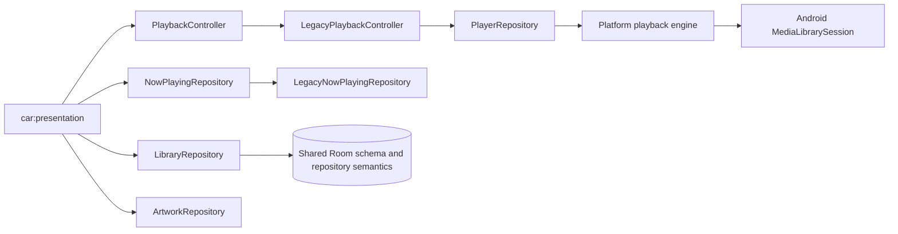

# Automotive playback reuse contract

## Ownership

The Automotive UI observes and commands the same runtime graph as the existing clients. `:car:presentation` depends only on domain contracts and owns no player, media session, queue engine, database, or source adapter.

- `PlaybackController.state`, `position`, and `queue` are the only Car playback state sources.
- `NowPlayingRepository.currentTrackInfo` supplies artwork and lyrics for the current item.
- The Car Activity attaches a Media3 controller to the runtime-owned `PlaybackService`; it does not construct ExoPlayer or MediaSession.
- Selecting Library item N maps the complete current `LibraryRepository.tracks` list to `PlayableItem`, preserves `LIBRARY_PLAYBACK_PLAYLIST_ID`, and calls `PlaybackController.play(items, N)`.
- Selecting queue item N calls the same controller with the complete current `PlaybackQueue.items` and index N. The Car UI never keeps an independent queue copy.
- Mini player, Now Playing, and Queue all collect the same flows. Play/pause, previous, next, seek, repeat, queue move/remove, and clear remain controller operations.

## Verification

Static ownership checks must continue to find one `ExoPlayer.Builder` and one `MediaLibrarySession.Builder`, both in `:core:runtime`. No source under `car/` or `carApp/` may import the runtime implementation classes behind these contracts except the Android Activity's existing `PlayerControllerRepository` Media3 attachment seam.
